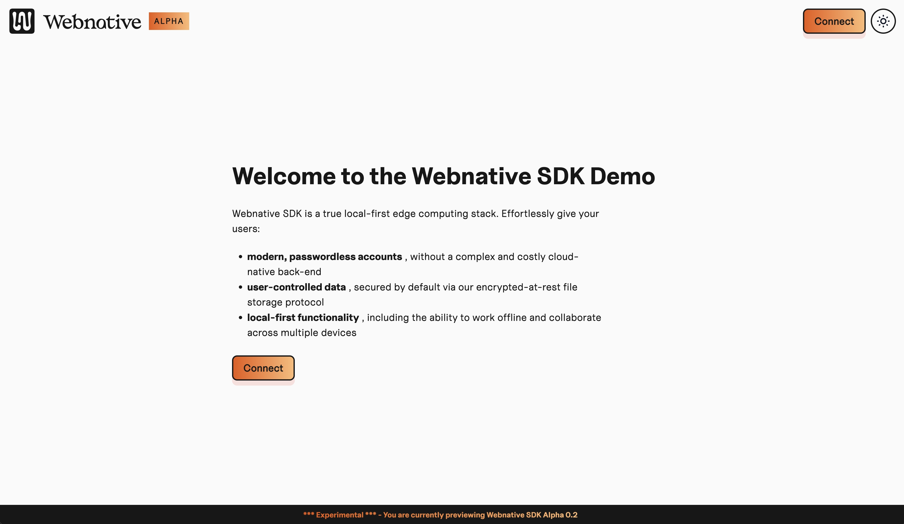
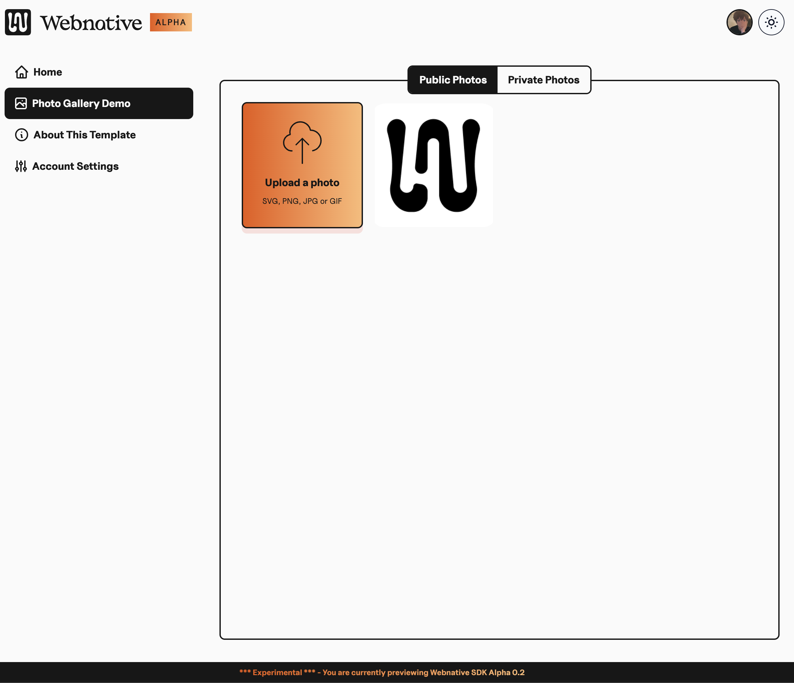

# Webnative App Template

[](https://fission.codes) [](https://github.com/fission-suite/webnative) [](https://discord.gg/zAQBDEq) [](https://talk.fission.codes)



The Webnative App Template is a clone-and-go template for building a web application using Webnative, fast. Clone, customize, and deploy to have a running distributed app in mere minutes.

## 🤔 What's Webnative?

[The Webnative SDK](https://github.com/fission-codes/webnative) empowers developers to build fully distributed web applications without needing a complex back-end. The SDK provides:

- user accounts (via [the browser's Web Crypto API](https://developer.mozilla.org/en-US/docs/Web/API/Web_Crypto_API)),
- authorization (using [UCAN](https://ucan.xyz))
- encrypted file storage (via the [Webnative File System](https://guide.fission.codes/developers/webnative/file-system-wnfs), backed by the [InterPlanetary File System](https://ipfs.io/), or IPFS)
- and key management (via websockets and a two-factor auth-like flow).

Webnative applications work offline and store data encrypted for the user by leveraging the power of the web platform. You can read more about Webnative in Fission's [Webnative Guide](https://guide.fission.codes/developers/webnative).

## 📦 What does this template give me?

### 🥰 Silky-smooth end-user flows

The Webnative App Template provides a _silky-smooth user experience_ out of the box. Creating an account and linking a second device feels familiar, comfortable, and obvious. Webnative authentication is key-based rather than password-based, so we've focused heavily on the authentication flows, borrowing language and screens from two-factor auth flows.

### 🧱 Built with a modern web stack

The app template is built with modern web technologies:

- SvelteKit (powered by Vite under the hood)
- TypeScript
- Tailwind
- DaisyUI

### 👩‍🏫 A simple Webnative demo to learn from



The app template includes a functioning application: an image gallery. Check out the image gallery code to learn how a Webnative application handles things like file uploads, directories, etc.

## 🚀 Getting Started

You can try out the template yourself [here](https://webnative.netlify.app/).

Ready? Let's go:

1. Clone the repository:

   ```shell
   git clone git@github.com:webnative-examples/webnative-app-template-react.git
   ```

2. Install the dependencies.

   ```shell
   npm install
   ```

3. Start the local development server.

   ```shell
   npm run start
   ```

4. Navigate to `http://localhost:3000` in your web browser.

## 🧨 Deploy

The [Webnative App Template demo](https://webnative.netlify.app) is currently hosted on Netlify, but it should be supported on any static hosting platform (Vercel, Cloudflare Pages, etc).

### Fission App Hosting

Coming soon!

_You can't currently deploy to Fission's app hosting infrastructure._ React Single-Page Applications require redirects in order to support routing. Redirects are not currently supported by IPFS, so the [Fission Publish GitHub action](https://github.com/fission-codes/publish-action) is not yet supported.

There is [work underway to extend IPFS http gateways to support redirects](https://github.com/ipfs/kubo/pull/8890). Once that is merged, deploying to Fission will work.

### Netlify

In order to deploy your Webnative application on Netlify:

1. Create a new Netlify site and connect your app's git repository. (If you don't have your application stored in a git repository, you can upload the output of a [static build](#static-build).)
2. Netlify takes care of the rest. No Netlify-specific configuration is needed.
3. There is no step 3.

### Static Build

Export a static build.

```shell
npm run build
```

The build outputs the static site to the `build` directory.
